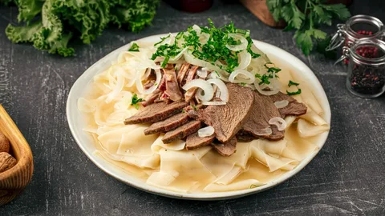
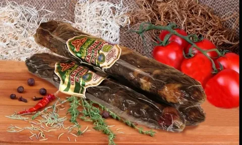
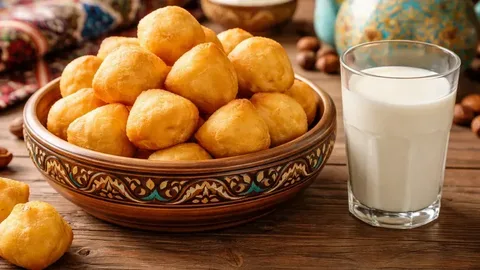

<!DOCTYPE html>
<html lang="ru">
<head>
    <meta charset="UTF-8">
    <meta name="viewport" content="width=device-width, initial-scale=1.0">
    <title>Qazaq Food</title>

    <link rel="stylesheet" href="2.css">
</head>
<body>

    <header>

        

            <h1>Qazaq Food</h1>

            

                Ресторан национальной кухни Казахстана
            

            <a href="#menu" class="btn">
                Смотреть меню
            </a>

        

    </header>

    <section id="menu">

        <h2>Наше меню</h2>

        

            

                

                <h3>Бешбармак</h3>

                

                    Традиционное казахское блюдо
                

                4500 ₸

            

            

                

                <h3>Казы</h3>

                

                    Домашняя колбаса из конины
                

                3500 ₸

            

            

                

                <h3>Баурсаки</h3>

                

                    Свежие горячие баурсаки
                

                1500 ₸

            

        

    </section>

    <section class="about">

        <h2>О ресторане</h2>

        

            Добро пожаловать в Qazaq Food.
            Мы готовим лучшие блюда
            казахской кухни из натуральных продуктов.
        

    </section>

    <footer>

        
📍 Казахстан, Кокшетау

        
☎️ +7 777 777 77 77

    </footer>

</body>
</html>
